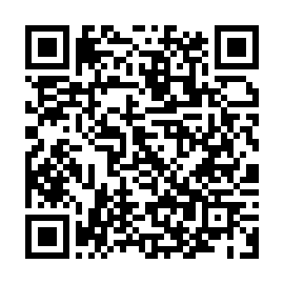

# CustomizerDS

A small homebrew app to customize your Nintendo 3DS: fonts, theme, accent color
and the notification LED. Everything works with the D-pad (touch is optional).

## Install

Open FBI, go to **Remote Install → Scan QR Code**:



Or download `CustomizerDS.cia` from the [Releases](https://github.com/syncmodz/CustomizerDS/releases/latest)
page and install it with FBI or GodMode9. There's also a `.3dsx` for the
Homebrew Launcher and emulators.

## What it does

- 9 bundled fonts (plus the system default) used inside the app
- 3 languages: English, Portuguese, Spanish (follows the console language)
- Light/dark theme with an accent color (presets or a HEX picker)
- RGB notification LED: solid, pulse, rainbow. The color comes back when you
  reopen the app
- Smooth tab transitions
- Full D-pad navigation

## Controls

```
D-pad   move / change value
A       select / apply
B       back
START   exit
```

## Notes

- The font you pick only changes how this app looks. Replacing the whole 3DS
  system font is a separate, manual job — see [docs/SYSTEM_FONT.md](docs/SYSTEM_FONT.md).
- Keeping the LED on after a reboot needs a Luma patch — see
  [docs/LED_PERSIST.md](docs/LED_PERSIST.md).

## Build

Needs devkitPro (libctru, citro2d), `tex3ds`, `mkbcfnt` and `makerom`.

```
make
```

## License

GPLv3 — see [LICENSE](LICENSE).
